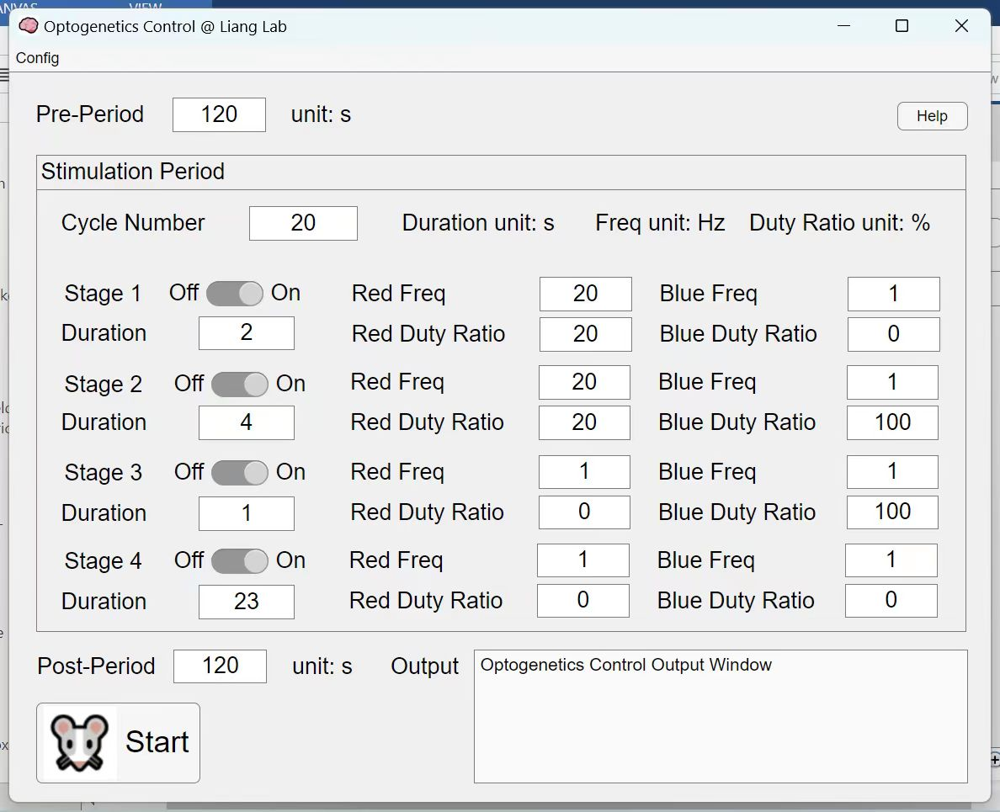
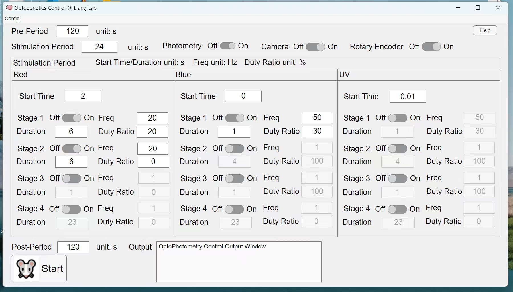
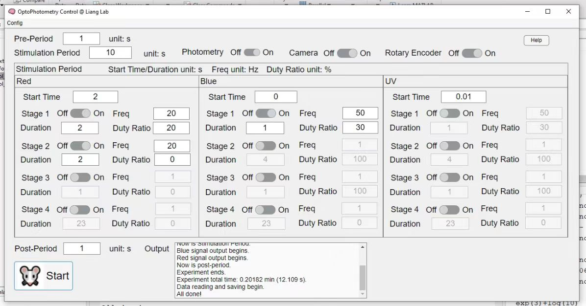

# Optogenetics-Photometry-System

Optogenetics-Photometry Hardware &amp; Software System

v1: basic version.

v2: add the "help" page.

v3: add the toolbar with the "config save" and "config load".

v4: fix a "config load" bug.

v4.1: fix a "config load" bug and a default setting bug; revise the help page.

v5: update the whole system to support more advanced control; improve the latency of the control; frequency and period can be non-integers; add NiDaq output data saving (input data and video have to be saved); add separate stage control for different lasers; add video recording control; add rotary encoder recording control; add photometry recording control; a completely new version, but the control of UV is not enabled because of hardware.

v6: synchronization of visual stimuli and opto/photometry is added; probably some other small improvements.
